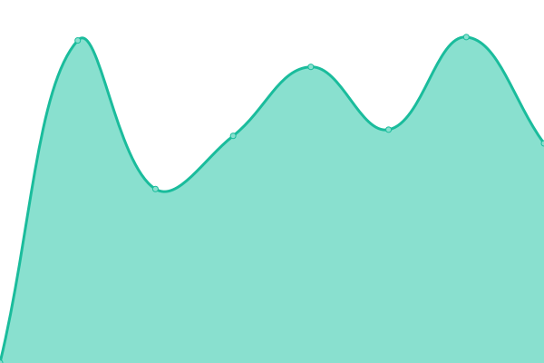
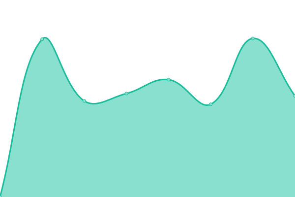
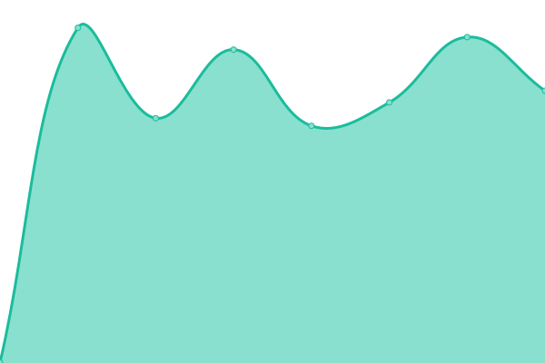

# [📈 Live Status](https://thohans.github.io/ikl_status): <!--live status--> **🟧 Partial outage**

This repository contains the open-source uptime monitor and status page for [thohans](https://thohans.github.io/ikl_status), powered by [Upptime](https://github.com/upptime/upptime).

With [Upptime](https://upptime.js.org), you can get your own unlimited and free uptime monitor and status page, powered entirely by a GitHub repository. We use [Issues](https://github.com/thohans/ikl_status/issues) as incident reports, [Actions](https://github.com/thohans/ikl_status/actions) as uptime monitors, and [Pages](https://thohans.github.io/ikl_status) for the status page.

<!--start: status pages-->
<!-- This summary is generated by Upptime (https://github.com/upptime/upptime) -->
<!-- Do not edit this manually, your changes will be overwritten -->
<!-- prettier-ignore -->
| URL | Status | History | Response Time | Uptime |
| --- | ------ | ------- | ------------- | ------ |
|  [bunnpris.no](https://bunnpris.no) | 🟥 Down | [bunnpris-no.yml](https://github.com/thohans/ikl_status/commits/HEAD/history/bunnpris-no.yml) | 

 0ms
     
 | 

<a href="https://thohans.github.io/ikl_status/history/bunnpris-no">0.00%</a>
    

|  [nettbutikk.bunnpris.no](https://nettbutikk.bunnpris.no) | 🟩 Up | [nettbutikk-bunnpris-no.yml](https://github.com/thohans/ikl_status/commits/HEAD/history/nettbutikk-bunnpris-no.yml) | 

 1056ms
     
 | 

<a href="https://thohans.github.io/ikl_status/history/nettbutikk-bunnpris-no">100.00%</a>
    

|  Citrix-portal | 🟩 Up | [citrix-portal.yml](https://github.com/thohans/ikl_status/commits/HEAD/history/citrix-portal.yml) | 

 1675ms
     
 | 

<a href="https://thohans.github.io/ikl_status/history/citrix-portal">100.00%</a>
    

|  Secret status location | 🟩 Up | [secret-status-location.yml](https://github.com/thohans/ikl_status/commits/HEAD/history/secret-status-location.yml) | 

 792ms
     
 | 

<a href="https://thohans.github.io/ikl_status/history/secret-status-location">100.00%</a>
    

|  Status hosting partner | 🟥 Down | [status-hosting-partner.yml](https://github.com/thohans/ikl_status/commits/HEAD/history/status-hosting-partner.yml) | 

 0ms
     
 | 

<a href="https://thohans.github.io/ikl_status/history/status-hosting-partner">0.00%</a>
    

<!--end: status pages-->

[**Visit our status website →**](https://thohans.github.io/ikl_status)

## 📄 License

- Powered by: [Upptime](https://github.com/upptime/upptime)
- Code: [MIT](./LICENSE) © [thohans](https://thohans.github.io/ikl_status)
- Data in the `./history` directory: [Open Database License](https://opendatacommons.org/licenses/odbl/1-0/)
